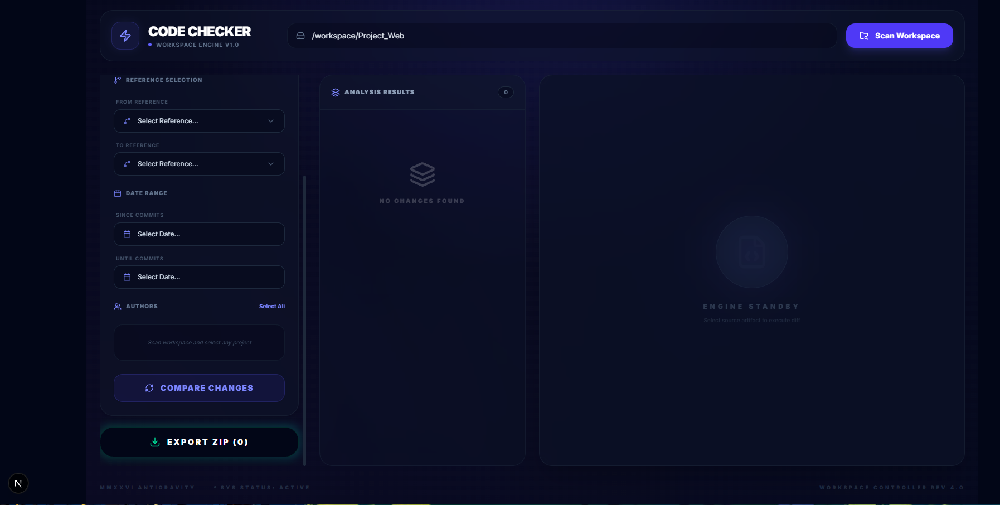

# Git Code Checker - Premium Dash v4



A state-of-the-art developer tool for tracking, comparing, and exporting code changes across multiple Git projects within a workspace. Built with **Next.js 15+** and **Tailwind CSS v4**.

## 🚀 Features

- **Recursive Workspace Scanning**: Automatically discover all Git repositories within any local directory.
- **Premium Glassmorphic UI**: High-fidelity design with a dark theme, utilizing the latest Tailwind CSS v4 features.
- **Advanced Filtering**: 
  - Compare between any two branches or tags.
  - Filter commits by specific Date Ranges.
  - Multi-select author filtering to isolate specific contributor work.
- **High-Fidelity Diff Viewer**: Unified diff view with line numbers and semantic syntax highlighting.
- **Smart ZIP Export**: Package filtered changes into a ZIP archive while preserving original directory structures.
- **Edge-Ready Architecture**: Built for performance and modern development workflows.

## 🛠️ Tech Stack

- **Framework**: Next.js 15 (App Router)
- **Styling**: Tailwind CSS v4 (PostCSS)
- **Icons**: Lucide React
- **Git Logic**: Simple-Git
- **Archiving**: JSZip
- **Language**: TypeScript

## 📦 Installation

1. **Clone the repository**:
   ```bash
   git clone git@github.com:haofrontend-dev/Tool_Check_Code_Git.git
   cd Tool_Check_Code_Git
   ```

2. **Install dependencies**:
   ```bash
   npm install
   ```

3. **Run the development server**:
   ```bash
   npm run dev
   ```

4. **Access the tool**:
   Open [http://localhost:3000](http://localhost:3000) in your browser.

## 🖥️ Usage

1. **Scan Workspace**: Enter the absolute path to your root workspace folder (e.g., `/home/user/projects`) and click **Scan Workspace**.
2. **Select Project**: Click on any discovered repository from the project list on the left.
3. **Configure Filters**:
   - Choose **From** and **To** references (branches/tags).
   - Set the **Date Range** if needed.
   - Select specific **Authors** from the populated list.
4. **Compare**: Click **Compare Changes** to generate the unified diff.
5. **Export**: Click **Export ZIP** to download the modified files.

## 🤝 Contributing

Feel free to fork this repository and submit pull requests for any features or bug fixes.

---
&copy; 2026 Git Code Checker Team. Built with ❤️ for developers.
